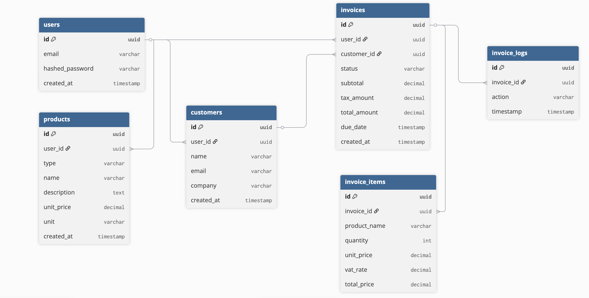

Backend system for invoice management with async processing.

## Features (MVP)
- JWT authentication
- Customer management
- Invoice generation
- PDF export
- Email sending (async)

## Architecture
- FastAPI
- PostgreSQL
- Redis
- Celery
- Docker

## ERD image
- created in dbdiagram.io



## API examples

### Auth
```
POST   /auth/register
POST   /auth/login
POST   /auth/refresh
GET    /auth/me
```
### Customers
```
POST   /customers
GET    /customers
GET    /customers/{id}
PUT    /customers/{id}
DELETE /customers/{id}
```
### Products
```
POST   /products
GET    /products
GET    /products/{id}
PUT    /products/{id}
DELETE /products/{id}
```
### Invoices
```
POST   /invoices
GET    /invoices
GET    /invoices/{id}
DELETE /invoices/{id}
```
### Invoice Actions
```
POST   /invoices/{id}/items
PATCH  /invoices/{id}/status
POST   /invoices/{id}/send
POST   /invoices/{id}/generate-pdf
```
### Stats
```
GET /stats/overview
```

## Run locally

docker compose up --build